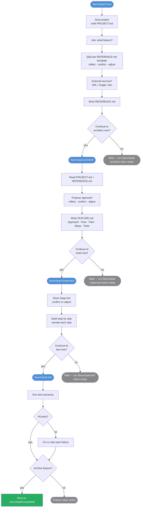

# Launchpad

Build your features in a guided, step-by-step flow. No prompts to write, no commands to memorize.

## Install

Run these inside Claude Code:

```
/plugin marketplace add Formartha/launchpad
/plugin install launchpad@launchpad
/reload-plugins
```

Then type `/launchpad-brain` to start.

## Flow



## What gets created

```
.launchpad/
├── PROJECT.md                  project knowledge base
├── features/
│   └── [feature-name]/
│       ├── STATE.md            phase tracking (launchpad-state only)
│       ├── REFERENCE.md        what to build (from your answers)
│       └── FEATURE.md          how to build it (from architect)
└── completed/
    └── [feature-name]/         archived features (not scanned)
```

## Skills

| Skill | What it does |
|---|---|
| `/launchpad-brain` | Entry point. Scans project, guides Q&A, writes REFERENCE.md |
| `/launchpad-architect` | Proposes design, writes FEATURE.md |
| `/launchpad-implement` | Builds the feature step by step |
| `/launchpad-test` | Tests all scenarios, archives when done |

## Internal skills (not user-facing)

| Skill | Purpose |
|---|---|
| `launchpad-state` | STATE.md lifecycle rules — read/write protocol |
| `launchpad-elicit` | Shared Q&A protocol — ask, reflect, confirm, adjust |
